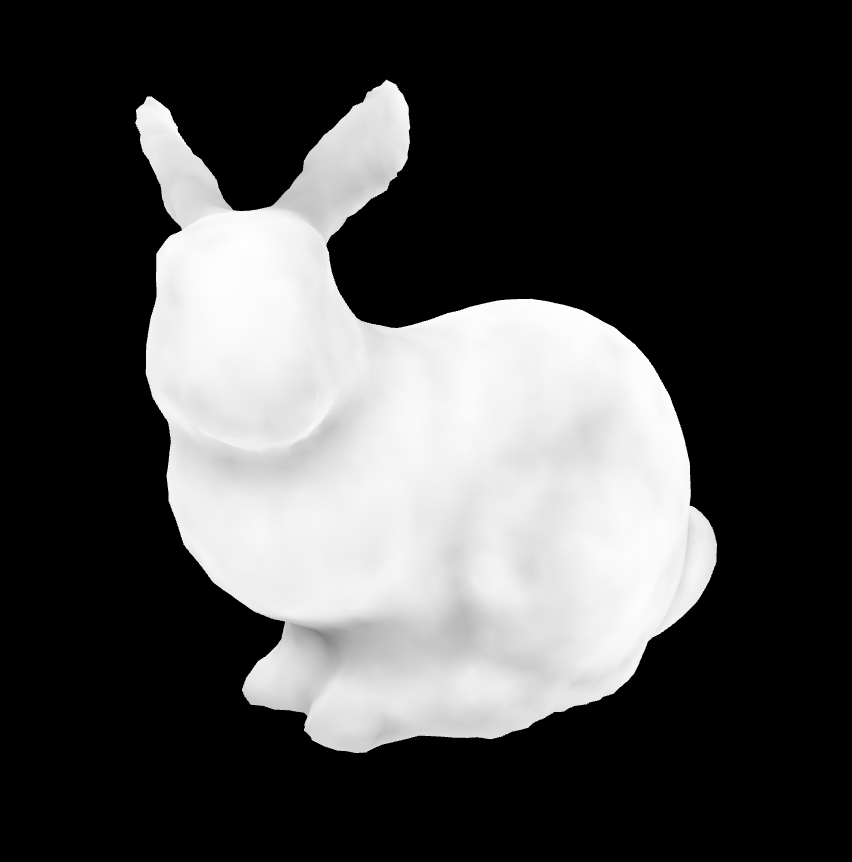

# vertex-ao
Calculates vertex based ambient occlusion values for a triangular mesh.



# Install

```
npm install vertex-ao
```

# Example

```javascript
var bunny = require('bunny')
var ao = require('vertex-ao')(bunny.cells, bunny.positions, 2, 256)
```

# API

### `require('vertex-ao')(cells, positions, radius, samples)`
Generates an ambient occlusion map for a mesh from the vertices of a mesh.

* `cells` are the cells of the mesh
* `positions` are the positions of the vertices of the mesh
* `radius` is the radius of the ambient occlusion samples
* `samples` are the number of samples to take for each triangle

# License

(c) 2017 MIT License.  Mikola Lysenko
